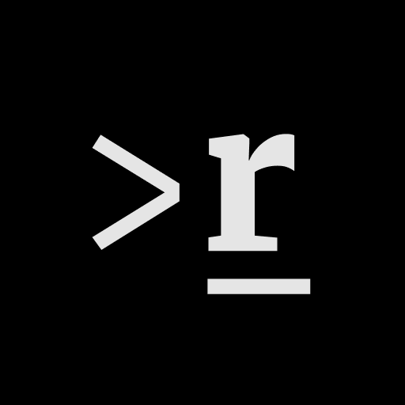

<p align="center">
  <a href="https://richard.pastenes.dev">
    
  </a>
</p>
<h1 align="center">
  Richard's Dev Site
</h1>

This is the repo for my portfolio/landing page at [https://richard.pastenes.dev](https://richard.pastenes.dev).

The site is built with Gatsby using the [Gatsby minimal starter](https://github.com/gatsbyjs/gatsby-starter-minimal), styled with [Tailwind CSS](https://tailwindcss.com/docs/guides/gatsby) and the data sourced from [Sanity.io](https://www.sanity.io/).

The birds animation is done with [Vanta.js](https://github.com/tengbao/vanta).

## Development

### Prerequisites

- Node.js (v18+)
- npm

### Getting Started

1. **Install dependencies:**

   ```bash
   npm install
   ```

2. **Start the Gatsby development server:**

   ```bash
   npm run develop
   ```

3. **Start Storybook (optional):**
   ```bash
   npm run storybook
   ```

### Sanity CMS

The content is managed through Sanity CMS. To run the Sanity Studio locally:

1. **Navigate to the CMS directory:**

   ```bash
   cd cms
   ```

2. **Install dependencies:**

   ```bash
   npm install
   ```

3. **Start the Sanity Studio:**
   ```bash
   npm start
   ```

The Sanity Studio will be available at [http://localhost:3333](http://localhost:3333).

### Available Scripts

**Main Project:**

- `npm run develop` - Start Gatsby development server
- `npm run build` - Build the project for production
- `npm run serve` - Serve the production build
- `npm run clean` - Clean Gatsby cache
- `npm run storybook` - Start Storybook development server
- `npm run build-storybook` - Build Storybook for production

**Sanity CMS:**

- `npm start` - Start Sanity Studio development server
- `npm run build` - Build Sanity Studio for production
