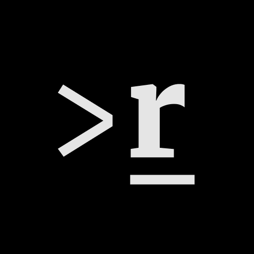

<p align="center">
  <a href="https://richard.pastenes.dev">
    
  </a>
</p>
<h1 align="center">
  🚀 Richard's Dev Site
</h1>

<p align="center">
  My personal portfolio & landing page — built with modern web tech, powered by a headless CMS, and deployed on the edge.
</p>

<p align="center">
  <a href="https://richard.pastenes.dev">🌐 Live Site</a> ·
  <a href="https://richard.pastenes.dev/resume">📄 Resume</a>
</p>

---

## ✨ Features

- ⚡ **Server-side rendered** with SvelteKit for fast initial loads and SEO
- 🎨 **Utility-first styling** with Tailwind CSS
- 📝 **Headless CMS** powered by Sanity with real-time content updates
- 🐦 **Interactive hero animation** using Vanta.js (Three.js birds)
- 🖨️ **Print-friendly resume** page with dedicated print styles
- 📱 **Fully responsive** across all devices
- ♿ **Accessible** with semantic HTML and ARIA labels

---

## 🛠️ Tech Stack

| Layer | Technology |
|-------|-----------|
| ⚙️ Framework | [SvelteKit 2](https://kit.svelte.dev/) + [Svelte 5](https://svelte.dev/) |
| 🎨 Styling | [Tailwind CSS 3](https://tailwindcss.com/) |
| 📦 CMS | [Sanity v5](https://www.sanity.io/) (Studio + Content Lake) |
| 🔍 Queries | [GROQ](https://www.sanity.io/docs/groq) via [@sanity/client](https://www.npmjs.com/package/@sanity/client) |
| 📝 Rich Text | [@portabletext/svelte](https://github.com/portabletext/svelte-portabletext) |
| 🖼️ Images | [@sanity/image-url](https://www.npmjs.com/package/@sanity/image-url) |
| 🐦 Animation | [Vanta.js](https://github.com/tengbao/vanta) (Three.js) |
| 🔤 Fonts | [Fontsource](https://fontsource.org/) (Fira Code, Montserrat, Open Sans, Poppins, PT Serif) |
| 🚀 Hosting | [Netlify](https://www.netlify.com/) (SSR via adapter-netlify) |

---

## 🏗️ Project Structure

```
├── src/
│   ├── routes/            # SvelteKit pages (+page.svelte, +page.server.ts)
│   ├── lib/
│   │   ├── sections/      # Page sections (Header, About, Work)
│   │   ├── components/    # Reusable components (Footer, Jumplinks, TechTags)
│   │   └── sanity.ts      # Sanity client & image URL builder
│   ├── app.html           # HTML shell
│   └── app.css            # Global styles & Tailwind directives
├── cms/
│   ├── sanity.config.ts   # Sanity Studio v5 configuration
│   ├── sanity.cli.ts      # CLI config with deployment settings
│   └── schemas/           # Document & object type definitions
├── tailwind.config.js
├── svelte.config.js
├── netlify.toml
└── package.json
```

---

## 🚀 Getting Started

### Prerequisites

- Node.js v24+
- npm

### 1. Clone & install

```bash
git clone https://github.com/pastenes/richards-dev-site.git
cd richards-dev-site
npm install
```

### 2. Set up environment variables

Create a `.env` file in the root:

```env
SANITY_PROJECT_ID=your_project_id
SANITY_DATASET=production
SANITY_TOKEN=your_read_token
```

### 3. Start developing

```bash
npm run dev
```

The site will be available at [http://localhost:5173](http://localhost:5173).

---

## 📦 Sanity Studio

The CMS lives in the `cms/` directory and is deployed separately.

```bash
cd cms
npm install
npm run dev
```

Studio runs at [http://localhost:3333](http://localhost:3333).

### Studio scripts

| Command | Description |
|---------|-------------|
| `npm run dev` | Start local development server |
| `npm run build` | Build studio for production |
| `npm run deploy` | Deploy studio to Sanity hosting |

---

## 📋 Available Scripts

| Command | Description |
|---------|-------------|
| `npm run dev` | Start SvelteKit dev server |
| `npm run build` | Build for production |
| `npm run preview` | Preview production build locally |

---

## 🌐 Deployment

The site deploys automatically to **Netlify** on push to `main`.

- **Build command:** `npm ci && npm run build`
- **Publish directory:** `build`
- **Runtime:** Node.js 24

Environment variables (`SANITY_PROJECT_ID`, `SANITY_DATASET`, `SANITY_TOKEN`) must be set in the Netlify dashboard.

---

## 📄 License

Private — all rights reserved.
